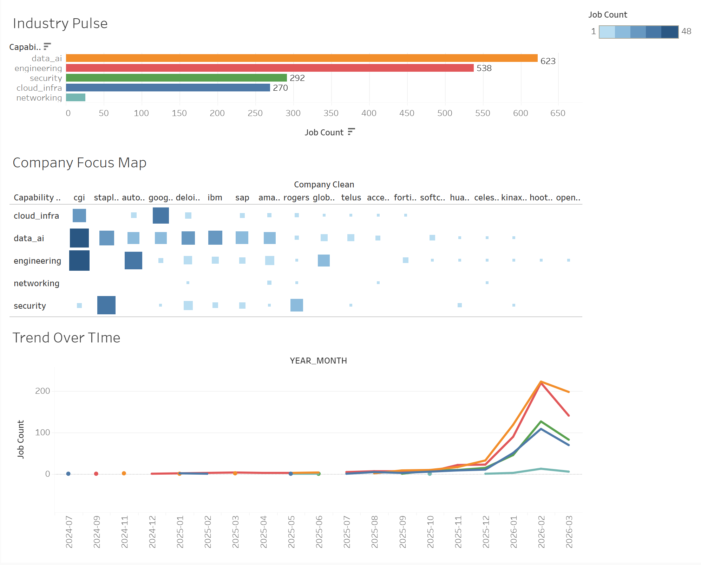

# 📊 Job Market Intelligence — Canadian Tech Companies

> **Personal learning project** built to develop hands-on experience with modern data engineering tools including ETL pipelines, Snowflake, Apache Spark (Databricks), and Tableau.

🔗 **[View Live Dashboard on Tableau Public](https://public.tableau.com/app/profile/vansh.khandelia/viz/Job-Marker-Intelligence/Dashboard1)**

---

## What This Project Does

Job postings are a leading indicator of company strategy. When a company posts jobs, they reveal what they are investing in before it shows up in press releases or earnings calls.

This project pulls real job postings from the top Canadian tech companies via the Adzuna API, processes them through a full medallion architecture, and surfaces insights about what each company is currently focused on — whether that's AI, cloud infrastructure, security, or engineering.

---

## Dashboard Preview



### Key Insights from the Dashboard

- **Data & AI is the #1 investment area** across Canadian tech companies with 623 job postings — ahead of engineering at 538
- **Security hiring is significant** at 292 jobs, driven by companies like Fortinet and Staples
- **Hiring surged in early 2026** across all capability domains, visible in the Trend Over Time chart
- **CGI and Google** show the strongest engineering and cloud signals respectively

---

## Architecture

```
Adzuna API (live job postings)
        ↓
Python Ingestion Script
(deduplication, type cleaning)
        ↓
Snowflake — Bronze Layer
(raw, unmodified job postings)
        ↓
Databricks — Silver Layer
(PySpark transformations, capability classification,
seniority extraction, remote flag, incremental load)
        ↓
Databricks — Gold Layer
(aggregations, tech share, rankings, trend by month)
        ↓
Snowflake — Gold Layer
(COMPANY_TECH_MIX table)
        ↓
Tableau Public
(live dashboard)
```

---

## Tech Stack

| Layer           | Tool                 | Purpose                         |
| --------------- | -------------------- | ------------------------------- |
| Data Source     | Adzuna API           | Live Canadian job postings      |
| Ingestion       | Python + pandas      | Extract, clean, deduplicate     |
| Data Warehouse  | Snowflake            | Bronze and Gold layers          |
| Compute         | Databricks (PySpark) | Silver and Gold transformations |
| Visualization   | Tableau Public       | Interactive dashboard           |
| Version Control | GitHub               | Code and documentation          |

---

## Data Pipeline

### Bronze Layer — Snowflake

Raw job postings land here exactly as they come from the API. No transformations, no cleaning. This is the source of truth and safety net — if anything breaks downstream, we can always reprocess from Bronze.

### Silver Layer — Databricks

PySpark notebook that reads new Bronze records incrementally and applies:

- Deduplication by `job_id`
- Company name standardization
- Job title cleaning and lowercasing
- Seniority extraction (Executive, Director, Senior, Mid, Junior)
- Remote flag detection
- Capability domain classification from job title

Capability domains classified: `data_ai`, `engineering`, `cloud_infra`, `security`, `networking`, `gtm`, `product`, `support_services`

Written back as a Delta table with append mode to preserve history.

### Gold Layer — Databricks → Snowflake

Aggregates Silver data by company, capability domain, and month to produce:

- Job count per company per capability per month
- Tech share (% of company's tech jobs in each domain)
- Capability rank within each company
- Dominant capability flag
- Tech intensity rank across all companies

Uses month-based deletion instead of truncation so historical trend data is preserved across pipeline runs.

---

## Companies Tracked

21 top Canadian tech companies including CGI, Fortinet, Google Canada, Amazon Canada, IBM, SAP, Deloitte, Accenture, Autodesk, Telus, Rogers, Staples, Global Relay, Kinaxis, Hootsuite, Softchoice, and more.

---

## Project Structure

```
job-market-intelligence/
│
├── ingestion/
│   ├── adzuna_extract.py        # Pulls job postings from Adzuna API
│   └── snowflake_loader.py      # Loads data into Snowflake Bronze
│
├── databricks/
│   ├── silver_transform.py      # PySpark Silver transformation
│   └── gold_transform.py        # PySpark Gold aggregation
│
├── snowflake/
│   ├── bronze_schema.sql        # Bronze table DDL
│   └── gold_schema.sql          # Gold table DDL
│
├── tableau/
│   └── screenshots/             # Dashboard screenshots
│
├── .env.example                 # Environment variable template
├── requirements.txt             # Python dependencies
└── README.md
```

---

## How to Run

### 1. Set up environment variables

Copy `.env.example` to `.env` and fill in your credentials:

```
ADZUNA_APP_ID=your_app_id
ADZUNA_APP_KEY=your_app_key
SNOWFLAKE_USER=your_user
SNOWFLAKE_PASSWORD=your_password
SNOWFLAKE_ACCOUNT=your_account
SNOWFLAKE_WAREHOUSE=COMPUTE_WH
SNOWFLAKE_DATABASE=JOB_INTELLIGENCE
SNOWFLAKE_SCHEMA=BRONZE
```

### 2. Install dependencies

```bash
pip install -r requirements.txt
```

### 3. Run ingestion

```bash
python ingestion/adzuna_extract.py
```

### 4. Run Silver transformation

Paste `databricks/silver_transform.py` into a Databricks notebook and run.

### 5. Run Gold transformation

Paste `databricks/gold_transform.py` into a Databricks notebook and run.

### 6. Refresh Tableau

Open Tableau, refresh the data extract, and republish to Tableau Public.

---

## What I Learned

- Designing and implementing a **medallion architecture** (Bronze → Silver → Gold)
- Using **Snowflake** for data warehousing — staging, schemas, warehouse management, DDL
- Using **Databricks** with **PySpark** for large-scale data transformations
- Building **incremental data pipelines** that only process new records
- **Delta Lake** for versioned, append-friendly storage
- **Tableau Public** for publishing interactive dashboards
- Real-world data quality challenges — deduplication, type mismatches, truncated text, boilerplate

---

## Roadmap

- [ ] Fix capability classification to reduce "other" category
- [ ] Add full job description scraping for richer skill extraction
- [ ] Automate monthly pipeline runs via Databricks Workflows
- [ ] Add more Canadian tech companies
- [ ] Build salary analysis layer when data is available

---

## Author

**Vansh Khandelia**
Built as a personal project to learn modern data engineering tools.
